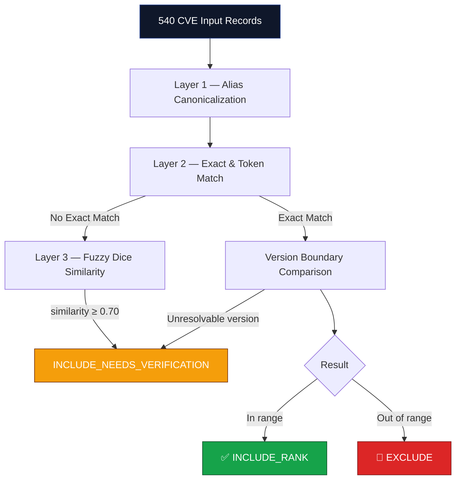
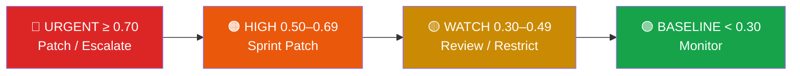

<div align="center">


<a href="https://github.com/Madhan310301/TriageCN">
  
</a>

<br/>

[](#-license)
[](#8-quick-setup-guide--5-minutes)
[](#8-quick-setup-guide--5-minutes)
[](#1-zero-live-network-dependency--data-pipeline)
[](#9-license)

</div>

<br/>

> **TriageCN** is a 100% client-side, zero-backend vulnerability triage cockpit built to kill **security alert fatigue**. Instead of ranking hundreds of CVEs by naive CVSS scores alone, it fuses technical severity, real-world exploitation signals (CISA KEV), exploitation likelihood (EPSS), asset exposure, service criticality, and exact software inventory version ranges into a defensible, context-aware **Top 5 Actionable Remediation Queue**.

<div align="center">

</div>

<div align="center">

### 📚 Table of Contents

[Overview](#-overview) • [Data Pipeline](#1-zero-live-network-dependency--data-pipeline) • [Matching Logic](#2-matching-logic-three-outcome-engine) • [Scoring Engine](#3-ranking--scoring-logic) • [Validation](#4-negative-testing--ground-truth-validation) • [Attribution](#5-data-sources--attribution) • [Ethics](#6-scope--ethical-use-disclaimer) • [Limitations](#7-assumptions--known-limitations) • [Setup](#8-quick-setup-guide--5-minutes) • [License](#9-license)

</div>

---

## ✨ Overview

<table>
<tr>
<td width="50%" valign="top">

### 🎯 What it solves
Security teams drown in CVE feeds ranked by raw CVSS. Most of those alerts are **irrelevant** to their actual stack. TriageCN filters the noise and surfaces only what's exploitable, exposed, and matters.

</td>
<td width="50%" valign="top">

### ⚡ How it works
Every CVE is matched against an organization's real technology inventory through a deterministic three-layer engine, then scored with a transparent, auditable formula — no black-box ML, no live APIs.

</td>
</tr>
</table>

<div align="center">

| 🧩 Feature | 📄 Detail |
|:---|:---|
| **Offline-first** | Zero `fetch`/`axios`/WebSocket calls in the judged runtime path |
| **Deterministic** | Template-driven explanations — no live LLM dependency |
| **540 CVEs** | Bundled in-memory at build/startup time |
| **6 Org Profiles** | Bank, SaaS startup, utility, logistics, research, health |
| **Auditable** | Every exclusion carries a traceable `exclusion_reason` |

</div>

---

## 1. Zero Live Network Dependency & Data Pipeline

TriageCN runs **100% offline and locally**, with zero external network or live API dependency in the judged path — strictly honoring the hackathon brief: *"The demo must run without paid data, paid software, or a live API dependency."*

- 🚫 **Zero Runtime Network Calls** — no live queries to NIST NVD, CISA KEV, or FIRST EPSS
- 🚫 **Zero Live LLM Dependency** — titles, explanations, and next-step actions are deterministic, template-driven, sourced only from the local CVE row
- 📦 **Static In-Memory Bundling** — all 540 CVE records and organizational profiles load into browser memory at startup
- 🔗 **Traceability Reference Links** — `reference_url` fields are static anchors to NIST NVD for manual human provenance review only, never queried programmatically

### Data Sources & Field Schemas

<details>
<summary><b>📄 <code>vulnerabilities.csv</code> — 540 CVE records</b> (click to expand)</summary>

<br/>

| Field | Description |
|---|---|
| `cve_id` | Unique CVE identifier (e.g. `CVE-2026-1769`) |
| `vendor` | Software vendor name (e.g. `SecNet`, `Apache`, `NodeJS`) |
| `product_name` | Affected software package/product |
| `version_start` / `version_end` | Affected version range boundaries |
| `version_note` | Advisory notes or vendor exceptions |
| `published_date` | Disclosure/publishing date |
| `description` | Plaintext vulnerability mechanism & impact summary |
| `cvss_base_score` | Base technical severity (0.0–10.0) |
| `cisa_kev` | Active in-the-wild exploitation flag (`TRUE`/`FALSE`) |
| `first_epss` | Exploit prediction probability (0.000–1.000) |
| `reference_url` | Canonical NIST NVD advisory link |
| `source_snapshot_date` | Fixed evaluation snapshot timestamp |

</details>

<details>
<summary><b>🏢 <code>profiles.json</code> — 6 Organizational Contexts</b> (click to expand)</summary>

<br/>

| ID | Organization | Sector | Risk Appetite | Service | Exposure | Importance |
|---|---|---|---|---|---|---|
| `ORG-001` | Global Retail Bank | Financial Services | Low | Core Banking | internet-facing | critical |
| `ORG-002` | Agile Cloud Tech Startup | Technology | High | Cloud SaaS API | internet-facing | high |
| `ORG-003` | Municipal Utility Provider | Critical Infrastructure | Zero-Tolerance | SCADA Telemetry | internal | critical |
| `ORG-004` | Apex Global Logistics | Transportation & Supply Chain | Moderate | Fleet Telematics | internet-facing | critical |
| `ORG-005` | Synthetic Zero-Match | Experimental Research | Low | Quantum Simulator | internal | normal |
| `ORG-006` | Helios Health | Digital Health & Life Sciences | Low | Patient Portal Gateway | internet-facing | critical |

Each profile also carries `weight_modifiers` (`cvss_weight`, `cisa_kev_weight`, `first_epss_weight`), a `technologies[]` inventory (`vendor`, `product`, `version`), and a `critical_products[]` list.

</details>

---

## 2. Matching Logic (Three-Outcome Engine)

Every CVE is run against an organizational profile through a strict, deterministic three-layer decision funnel:



### The Three Outcomes

| Outcome | Meaning | Scoring Impact |
|---|---|---|
| ✅ **`INCLUDE_RANK`** | Product & vendor match the stack (exact or alias-resolved), version proven within affected range | Fully scored, eligible for Top 5 |
| ⚠️ **`INCLUDE_NEEDS_VERIFICATION`** | Product matches inventory, but version boundary can't be mathematically proven (missing version, advisory `version_note`, or fuzzy token overlap) | Confidence penalty (**−0.05 / −0.10**) to avoid false security |
| 🚫 **`EXCLUDE`** | Software absent from inventory, or installed version proven outside the vulnerable boundary | Auditable `exclusion_reason` attached |

**Alias Canonicalization** — common naming variants are normalized deterministically, e.g. `httpd → http_server`, `wp → wordpress`, `nodejs framework → nodejs`, `expressjs web engine → express`, `microsoft corp → microsoft`.

**Semantic Version Comparison** — versions compared chunk-by-chunk as integer tuples, cleanly handling partial semver (`2.4.49` vs `2.4.50`, `6.1` vs `6.0`, `11.0` vs `10.0`). Non-standard strings safely fall back to `INCLUDE_NEEDS_VERIFICATION`.

**Deduplication Guarantee** — input rows are deduplicated by composite key `(cve_id, product_name)` before ranking, so every CVE-product pair is evaluated exactly once.

---

## 3. Ranking & Scoring Logic

<div align="center">

$$\text{Score} = \left(\frac{\text{CVSS}}{10}\right) \times W_{\text{CVSS}} + \text{KEV} \times W_{\text{KEV}} + \text{EPSS} \times W_{\text{EPSS}} + \text{Exposure Bonus} + \text{Importance Bonus} - \text{Confidence Penalty}$$

</div>

<table>
<tr><th>Term</th><th>Definition</th></tr>
<tr><td><b>CVSS Base Score</b></td><td>Technical severity normalized 0.0–1.0, weighted by <code>W_CVSS</code></td></tr>
<tr><td><b>CISA KEV</b></td><td>Binary active-exploitation flag (1.0 / 0.0), weighted by <code>W_KEV</code></td></tr>
<tr><td><b>First EPSS</b></td><td>Exploit prediction probability (0.000–1.000), weighted by <code>W_EPSS</code></td></tr>
<tr><td><b>Asset Exposure Bonus</b></td><td><code>internet-facing</code> +0.20 &nbsp;·&nbsp; <code>internal</code> +0.05</td></tr>
<tr><td><b>Asset Importance Bonus</b></td><td><code>critical</code> +0.15 &nbsp;·&nbsp; <code>high</code> +0.10 &nbsp;·&nbsp; <code>normal</code> +0.05</td></tr>
<tr><td><b>Confidence Penalty</b></td><td>Unverified version −0.05 &nbsp;·&nbsp; Fuzzy match (≥70%) −0.10</td></tr>
</table>

### Priority Bands & Operational Directives



| Band | Score | Directive |
|---|---|---|
| 🔴 **URGENT** | ≥ 0.70 | Immediate escalation — high exploitation threat to critical assets |
| 🟠 **HIGH** | 0.50 – 0.69 | Scheduled sprint remediation — confirmed vulnerability on active stack |
| 🟡 **WATCH** | 0.30 – 0.49 | Proactive monitoring — internal exposure or unexploited flaws |
| 🟢 **BASELINE** | < 0.30 | Standard patching cycle — low exploitation probability, non-critical service |

---

## 4. Negative Testing & Ground-Truth Validation

- **Featured CVSS ≥ 9.0 Negative Test** — the Overview page prominently surfaces high-severity CVEs (e.g. `CVE-2026-1769`, CVSS 9.4) that are *rightfully excluded* because the product isn't in the organization's inventory, proving the engine resists alert fatigue rather than just chasing high scores.
- **Zero-Match Handling** — for unrepresented profiles (e.g. `ORG-005`), TriageCN reports the honest verified state — *"Nothing matched this profile in the supplied data"* — instead of fabricating rankings.

---

## 5. Data Sources & Attribution

- **Vulnerability datasets** sourced from NIST's National Vulnerability Database (NVD), CISA's Known Exploited Vulnerabilities (KEV) catalog, and FIRST's Exploit Prediction Scoring System (EPSS), used under each source's respective public usage terms.
- This is a **static, frozen demonstration snapshot** — not a live feed — and is not officially affiliated with, endorsed by, or representing NIST, CISA, or FIRST.
- **All organization profiles are entirely fictional and synthetic** — no real organizations, real vulnerabilities-in-context, or personal data are represented.

---

## 6. Scope & Ethical Use Disclaimer

> ⚠️ **Defensive Triage Aid Only.** This prototype assists security analysts by reporting which known vulnerabilities match a stated technology profile. It never claims an organization is secure, immune, or vulnerability-free.

- ✅ Zero scanning, probing, or live testing of any network or software system
- ✅ No exploit code included, executed, or generated
- ✅ Zero personally identifiable information (PII) collected, stored, processed, or displayed

---

## 7. Assumptions & Known Limitations

<table>
<tr><td width="50%" valign="top">

**Assumptions**
1. Versions follow standard semver (`major.minor.patch`) or clean numeric prefixes
2. Canonical alias mappings cover standard catalog naming variations
3. Data reflects a fixed evaluation snapshot; live updates require refreshing the local CSV

</td><td width="50%" valign="top">

**Known Limitations**
1. Non-standard/vendor-specific version formats route safely to **Needs Verification** (−0.05) rather than being auto-matched or wrongly excluded
2. Built exclusively for offline, zero-network execution — no live external enrichment or background callbacks

</td></tr>
</table>

---

## 8. Quick Setup Guide (< 5 Minutes)

<div align="center">

</div>

**Prerequisites:** Node.js ≥ 18.0.0 · pnpm ≥ 9.0.0 (or npm / yarn)

```bash
# 1. Clone the repository
git clone https://github.com/Madhan310301/TriageCN.git
cd TriageCN

# 2. Install dependencies (~20 seconds)
pnpm install

# 3. Start the development server
pnpm dev
```

➡️ Visit **`http://localhost:5173`** in your browser.

<details>
<summary><b>🏗️ Production Build & Preview</b></summary>

<br/>

```bash
# Run typecheck and production build
pnpm run build

# Preview static production build locally
pnpm run preview
```

</details>

---

## 9. License

<div align="center">

Released under the **MIT License**. Designed and developed for the **Nexora 2k26 Hackathon**.


<sub>Made with 🛡️ to fight alert fatigue, one context-aware score at a time.</sub>

</div>
